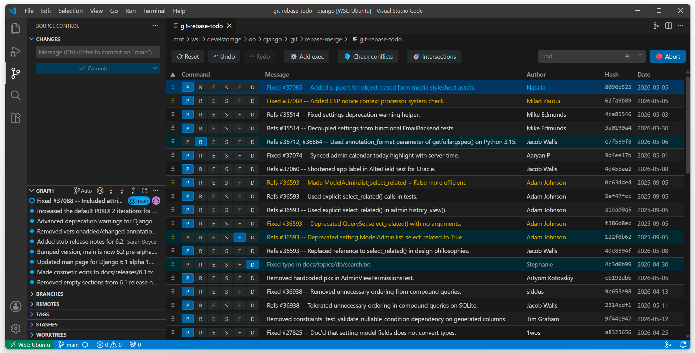
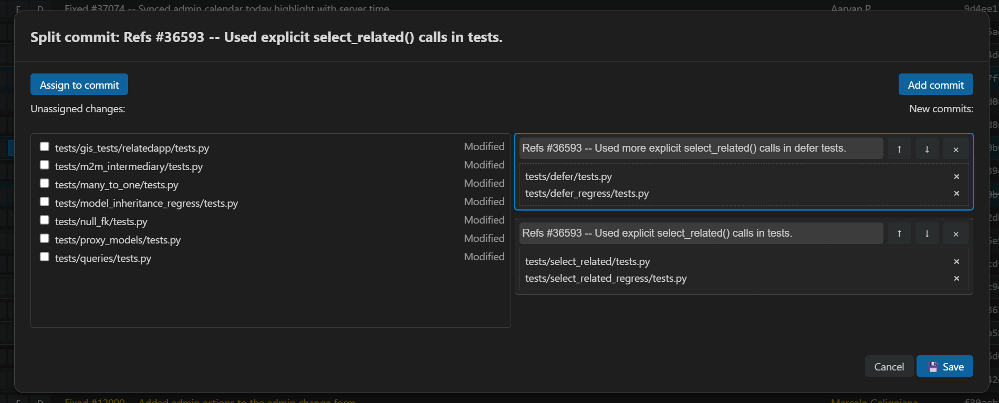

# I-Rebase

I-Rebase is a Visual Studio Code extension that provides an interactive editor for Git rebase operations. The extension allows users to visually reorder, edit, and manage Git commits during an interactive rebase session.

## Features

- Interactive Git rebase editor with drag-and-drop functionality
- Visual representation of commits with branches and tags
- Ability to change commit order via drag-and-drop or arrow buttons
- Support for common rebase commands (pick, reword, edit, squash, fixup, drop)
- Integration with VS Code's SCM view
- Conflict detection and visualization
- Commit splitting functionality
- Undo/redo capabilities
- Search functionality
- Keyboard shortcuts support. Arrow keys to navigate, Ctrl+Left/Ctrl-Right to switch action.

Main window

Split dialog

## How to Use

1. Open a Git repository in VS Code.
2. Init a rebase session by manual `git rebase -i` or via the `Interactive rebase` submenu on the SCM toolbar. It offers `Up to Last Push` (rebase all local commits not yet pushed), presets `20` / `50` last commits, `Custom Refspec...` (branch, tag, hash or HEAD~N) and `N Last Commits...` (manual input).
   If the rebase fails to start (uncommitted changes, active rebase, conflicts), a notification with suggested actions (Stash / Retry / Open Rebase Editor / Abort / Show Log) is shown, and full details are logged to the `I-Rebase` output channel.
3. Drag and drop commits to reorder them, or use the command buttons to modify their actions (`Ctrl+Left` / `Ctrl+Right` with keyboard).
4. You may inline edit commit message for "Reword" action.
5. You may split commits with multiple files into smaller commits. Set "Edit" action for commit and press on scissors button near commit message.
4. Before applying changes you can check for probable conflicts with "Check conflicts" button on toolbar.
5. To find commits modifying same files select commit and click "Intersections" button on toolbar - main and dependant commits will be highlighted.
6. You may undo / redo operations.
7. Save your changes and close window to continue rebase process.

## Settings

The I-Rebase extension provides the following settings:

- `irebase.reverseOrder`: Show commit list in reverse order (newer higher). Default is `false`.
- `irebase.actionViewKind`: View kind of commit actions set. Available options are `buttons` (set of buttons) and `dropdown` (dropdown list). Default is `buttons`.

## Requirements

- Git must be installed and accessible from the command line
- VS Code version 1.93.0 or higher

### Set VS Code as the Default Rebase Editor

To make VS Code the editor that pops up whenever you run git rebase -i in your terminal, run this command:

`git config --global core.editor "code --wait"`

## License

MIT
